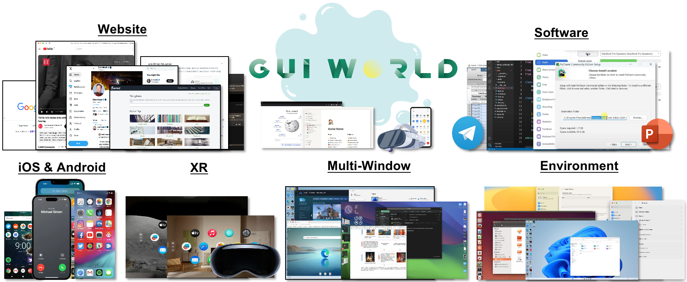
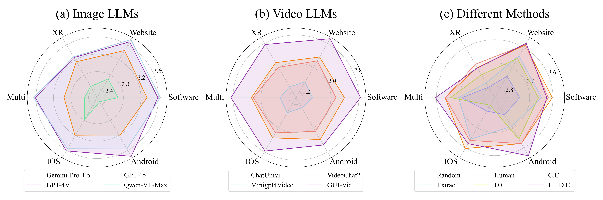

<div align="center">
<h1>GUI-World: A Dataset for GUI-Orientated Multimodal Large Language Models

[](https://arxiv.org/abs/2406.10819) [](https://huggingface.co/datasets/shuaishuaicdp/GUi-World) [](https://gui-world.github.io/)

  



<p align="center">

</p>
</div>

## Updates & News
**Github Repository still in Constuction...**
- [16/06/2024] :page_facing_up: Paper on [arxiv](https://arxiv.org/abs/2406.10819) has released!

## Contents
- [Updates \& News](#updates--news)
- [Contents](#contents)
- [Dataset: GUI-World](#dataset-gui-world)
  - [Overview](#overview)
  - [How to use GUI-World](#how-to-use-gui-world)
- [GUI-Vid: A GUI-Oriented VideoLLM](#gui-vid-a-gui-oriented-videollm)
- [Contribution](#contribution)
- [Acknowledgments](#acknowledgments)
- [Citation](#citation)

## Dataset: GUI-World

### Overview
GUI-World introduces a comprehensive benchmark for evaluating MLLMs in dynamic and complex GUI environments. It features extensive annotations covering six GUI scenarios and eight types of GUI-oriented questions. The dataset assesses state-of-the-art ImageLLMs and VideoLLMs, highlighting their limitations in handling dynamic and multi-step tasks. It provides valuable insights and a foundation for future research in enhancing the understanding and interaction capabilities of MLLMs with dynamic GUI content. This dataset aims to advance the development of robust GUI agents capable of perceiving and interacting with both static and dynamic GUI elements.

### How to use GUI-World
GUI-World is splited to train and test set, which can be accessed from [huggingface](https://huggingface.co/datasets/shuaishuaicdp/GUI-World).

## GUI-Vid: A GUI-Oriented VideoLLM 
GUI-Vid is a VideoLLM finetuned from [Videochat2](https://github.com/OpenGVLab/Ask-Anything). You can reproduce our experiment results following these instructions:
**Prepare the Environment**
```shell
git clone https://github.com/OpenGVLab/Ask-Anything.git
cd Ask-Anything/video_chat2
conda create -n videochat2 python=3.9
conda activate videochat2
pip install -r requirements.txt
```
**GUI-Oriented Finetuning**
- Download [GUI-World] and use our prepated script `scripts/instruction_data.py` to replace the file in `Ask-Anything/video_chat2/configs/instruction_data.py`, and set your path for the `anno_root_it` in that file, which is the root dir for your download GUI-World.
- Set `vit_blip_model_path`, `llama_model_path` and `videochat2_model_path` in `Ask-Anything/video_chat2/scripts/videochat_vicuna/config_7b_stage3.py`, these checkpoints can be download from [Videochat2](https://github.com/OpenGVLab/Ask-Anything/tree/main/video_chat2) and [GUI-Vid](https://huggingface.co/shuaishuaicdp/GUI-Vid).
```shell
# Vicuna
bash scripts/videochat_vicuna/run_7b_stage3.sh
```

**Inference with GUI-Vid**
You can first download checkpoint from [Huggingface](https://huggingface.co/shuaishuaicdp/GUI-Vid). You also need to set the config according to the guidance in [Videochat2](https://github.com/OpenGVLab/Ask-Anything/tree/main/video_chat2).
Then, move `scripts/demo_local.py` to `Ask-Anything/video_chat2`, and set the `model_path` in `scripts/demo_local.py`. Use the following script to inference a GUI video:

```shell
python demo_local.py \
--ckpt_path <path to GUI-Vid> \
--keyframe 8 \
--video_path <path to your video> \
--qs <your query> 
```
## Contribution
Contributions to this project are welcome. Please consider the following ways to contribute:

- Proposing new features or improvements
- Benchmark other mainstream MLLMs


## Acknowledgments
Many thanks to Yinuo Liu, Zhengyan Fu, Shilin Zhang, Yu, Tianhe Gu, Haokuan Yuan, and Junqi Wang for their invalueble effort in this project. This project is based on methodologies and code presented in [Videochat2](https://github.com/OpenGVLab/Ask-Anything).

## Citation
```
@misc{chen2024guiworld,
      title={GUI-WORLD: A Dataset for GUI-oriented Multimodal LLM-based Agents}, 
      author={Dongping Chen and Yue Huang and Siyuan Wu and Jingyu Tang and Liuyi Chen and Yilin Bai and Zhigang He and Chenlong Wang and Huichi Zhou and Yiqiang Li and Tianshuo Zhou and Yue Yu and Chujie Gao and Qihui Zhang and Yi Gui and Zhen Li and Yao Wan and Pan Zhou and Jianfeng Gao and Lichao Sun},
      year={2024},
      eprint={2406.10819},
      archivePrefix={arXiv},
}
```